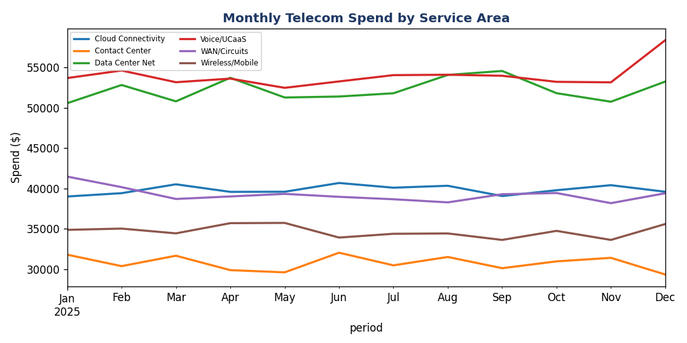
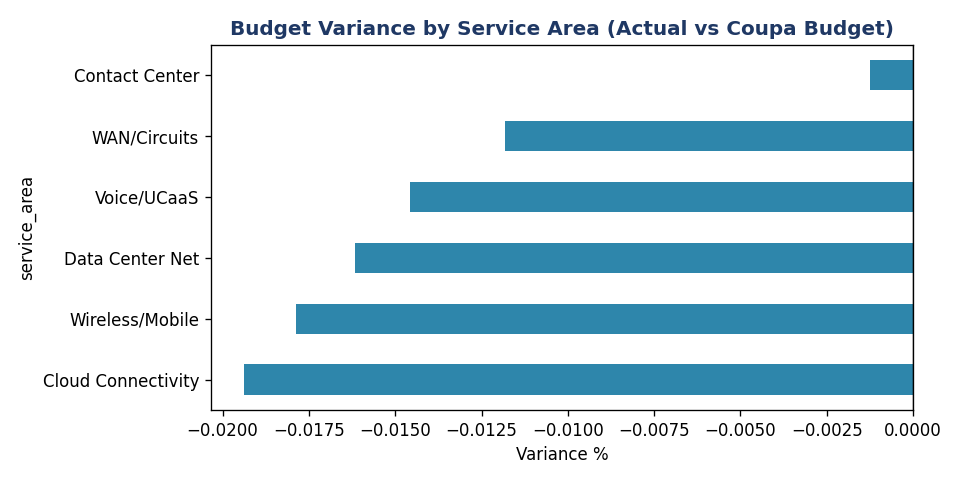
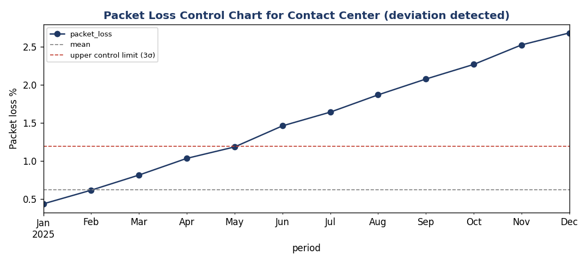
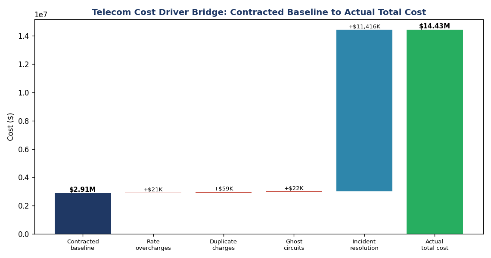
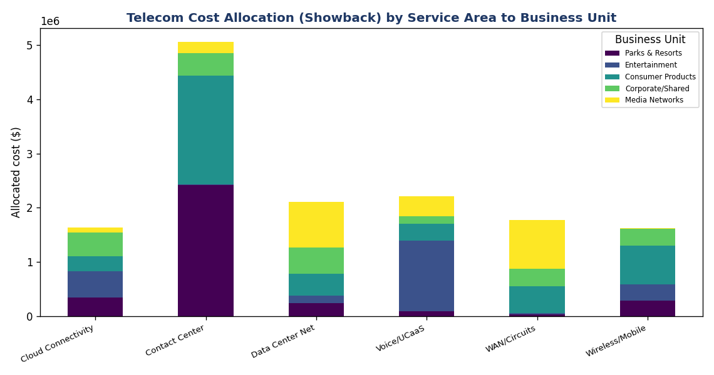
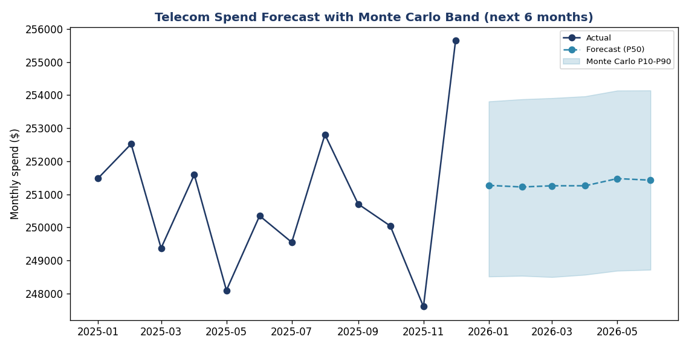
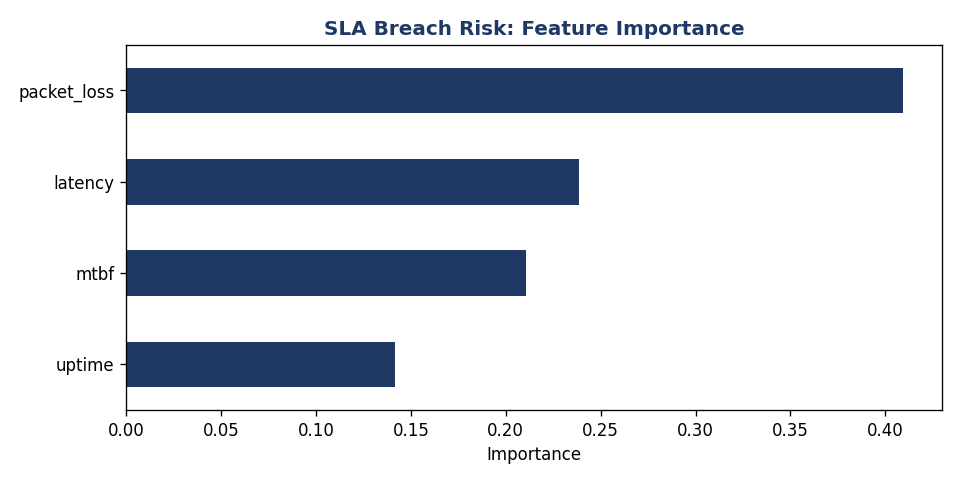

# MouseHouse-enterprise-telecom-finops
### Operational & Financial Risk Analytics for a Large Technology / Telecom Estate

   

An end-to-end analytics platform that manages the **operational and financial risk** of a simulated enterprise **technology/telecom** estate. It audits vendor invoices, charges service costs back to business units, monitors **service-area success metrics for deviations**, and forecasts cost and risk. Built with **SQL, Python, R, DuckDB (Snowflake-style), Tableau + Power BI, and a CI/CD pipeline**.

> **All data is synthetic and reproducible** (seeded generator). It contains deliberately planted anomalies (billing errors, a costly vendor, a degrading service area) for the analytics to discover.

---

## Results (auto-generated from a single `make all` run)

- **2,948** telecom invoice lines audited → **133 mis-billed lines (4.5%)** flagged
- **~$102K** in recoverable spend / **cost avoidance** identified (rate overcharges, duplicates, ghost circuits)
- **Contact Center** service area flagged **breaching its 3σ packet-loss control limit**, caught mid-year, well before an outage
- Vendor scorecard ranks spend-per-incident to surface the worst-performing carrier
- **Diagnostic bridge** reveals incident-resolution labor (not circuit rates) is the dominant cost driver, a non-obvious executive insight
- **Chargeback/showback** allocates total cost across 5 business units by consumption weight
- **Predictive forecast** projects next-quarter spend with a Monte Carlo P10-P90 band
- **SLA-breach risk model** predicts financial risk from telemetry alone (ROC-AUC 0.96); packet loss is the top leading indicator; Contact Center flagged 99%
- **AI triage + eval harness** classifies invoice anomalies at 97.5% accuracy and *honestly surfaces* a ghost-circuit recall gap (needs a CMDB status join), the answer-integrity discipline of real AI evaluation
- Month-end reporting reduced from a manual pull to a **~1-minute automated pipeline**

| Telecom spend trend | Budget variance | Deviation detection |
|---|---|---|
|  |  |  |

| Cost-driver bridge (diagnostic) | Chargeback / showback |
|---|---|
|  |  |

| Spend forecast + Monte Carlo | SLA-breach risk drivers |
|---|---|
|  |  |

---

## Why this repo maps to the job (Senior Data Analyst, Enterprise Technology/Telecom)

| Job description language | Where it lives in this repo |
|---|---|
| Accounting/finance **and** automation/modeling for **operational & financial risk** | finance marts (SAP/Coupa) + operational telemetry (ServiceNow/ITOM) fused into one model |
| **Telecom** experience | `fct_invoice_audit` (Telecom Expense Mgmt), circuit/asset inventory, uptime/MTBF/latency/packet-loss telemetry |
| **Descriptive, diagnostic, predictive** analyses | `analysis/descriptive.py` (+ diagnostic variance & predictive forecast on the roadmap) |
| Success **metrics by service area** + monitor **deviations** | `fct_service_area_monthly` + SPC control-limit deviation detection |
| **Automation** of financial processes | `make all` runs generate → transform → analyze; GitHub Actions CI on every push |
| Communicate **risks/recommendations** to leadership | `reports/` executive summary + memo template |
| Preferred stack: Excel, ServiceNow, SAP, Tableau, SQL, R, Power BI, Coupa, Python, CI/CD | each modeled as a real component (see Architecture) |

---

## Architecture

```
ServiceNow (incidents, CMDB) ┐
ITOM telemetry               │
Telecom carrier invoices     ├─► DuckDB / SQL marts ─► analysis (Python/R) ─► Tableau + Power BI
SAP GL (cost centers)        │      (models/)            (analysis/)            (dashboards/)
Coupa POs / budget           ┘                                │
                                                              └─► reports/ (exec one-pager, memos)
```

## Run it yourself (under a minute)

```bash
pip install -r requirements.txt
make all      # generate synthetic data → build SQL marts → run analysis + charts
make test     # data-quality + logic tests
```

## Repo layout

```
src/            data generator, ETL runner (pandas + DuckDB)
models/         Snowflake-style SQL transformation marts
analysis/       descriptive/diagnostic analysis + charts (scorecard SPC)
data/           raw (generated) + processed marts
dashboards/     Tableau + Power BI (screenshots / workbooks)
reports/        executive one-pager + ad-hoc memo template
docs/           data dictionary, KPI governance, architecture
tests/          pytest data-quality + logic checks (run in CI)
```

## Roadmap
- [x] Synthetic sources + SQL marts + descriptive analysis + CI
- [x] Invoice audit (cost avoidance) + service-area SPC deviation detection
- [x] Diagnostic cost-driver bridge + chargeback/showback
- [x] Predictive spend forecast + Monte Carlo band + SLA-breach risk model
- [x] AI invoice-anomaly triage + eval harness (LLM-swappable)
- [ ] Tableau Public link + Power BI dashboard

*Built by Luis A. Delgado. LinkedIn: [linkedin.com/in/luis-a-delgado-jr](https://linkedin.com/in/luis-a-delgado-jr). Synthetic data only; not affiliated with any employer.*
